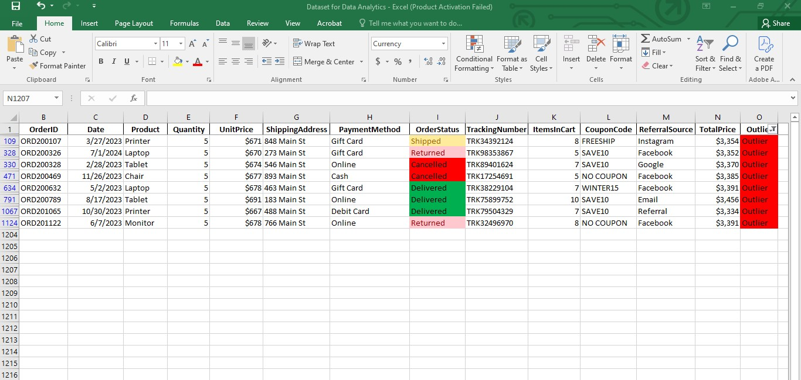

# Sales Performance Analysis
## Exploratory Data Analysis with Power BI Dashboard

**Tools Used:** Microsoft Excel, Power BI

**Dataset:** Sales Transaction Dataset

**Total Records:** 1,200 rows

**Internship:** DecodeLabs 2026

## Project Overview
This project is a full sales performance analysis
covering everything from raw data cleaning to an interactive
Power BI dashboard. The goal was to interrogate 1,200 sales
transactions and extract meaningful business insights about
product performance, customer behavior, payment patterns,
and order fulfillment.

**Headline Finding:

** Total revenue of **$1,264,762** was
generated across 1,200 orders but with only **231 successful
deliveries** and **497 cancellations and returns combined**,
the business has a critical fulfillment problem that is
quietly eroding its bottom line.

---

## The Business Question
With 1,200 transactions across multiple products, payment
methods, and referral channels **which areas are driving
revenue and which are silently killing it?** Every chart,
pivot table, and dashboard visual in this project was built
to answer that question with precision.

---

## Project Files

| File | Description |
|------|-------------|
| [Dataset for Data Analytics.xlsx](Dataset%20for%20Data%20Analytics.xlsx) | Fully cleaned sales dataset with pivot tables and analysis |
| [Summary Table.jpg](Summary%20Table.jpg) | Descriptive statistics summary |
| [Revenue by Product and Payment method per Order.jpg](Revenue%20by%20Product%20and%20Payment%20method%20per%20Order.jpg) | Revenue and payment analysis charts |
| [Quantity per Product and Order Status.jpg](Quantity%20per%20Product%20and%20Order%20Status.jpg) | Units sold and order status charts |
| [Customer Acquisation by referral source.jpg](Customer%20Acquisation%20by%20referral%20source.jpg) | Customer acquisition by referral source |
| [Monthly Sales Trend.jpg](Monthly%20Sales%20Trend.jpg) | Monthly sales trend line chart |
| [Outlier Metrics.jpg](Outlier%20Metrics.jpg) | IQR outlier calculation table |
| [Outlier.jpg](Outlier.jpg) | Flagged outlier results |
| [sales performance.png](sales%20performance.png) | Final Power BI dashboard |

---

## Tools Used
- **Excel** — data cleaning, descriptive statistics,
pivot tables, charts, IQR outlier detection,
conditional formatting
- **Power BI** — interactive single page dashboard
with slicers, KPI cards, and 6 chart visuals

---

## Data Cleaning Steps

### 1. Handled Missing Values
The Coupon Code column contained several empty cells.
Each missing entry was filled with "No Coupon" to maintain
data completeness and ensure no rows were lost.

### 2. Fixed Currency Formatting
Unit Price and Total Unit Price columns were reformatted
from plain numbers to proper currency format for
consistency and readability.

### 3. Standardized Date Format
The Date column was converted from short date format
to long date format for clarity across all records.

### 4. Adjusted Column Widths
All columns were resized to properly accommodate their
entries ensuring no data was hidden or cut off.

### 5. Relocated Primary Key Column
The Customer ID column was moved to Column A following
standard database structuring conventions.

### 6. Applied Conditional Formatting
Color coded conditional formatting was applied to the
Order Status column for quick visual identification of
Delivered, Pending, Cancelled, Returned and Shipped orders.

---

## Descriptive Statistics

---

## Exploratory Data Analysis

### 1. Revenue and Payment Analysis
- Total revenue across all products was **$1,264,762**
- **Chair** and **Printer** were top revenue generators
at approximately **$195,000 each**
- **Phone** recorded the lowest revenue at **$151,722**
- **Online payment** was the most preferred method
with **258 transactions**
- **Gift Card** was the least used at **230 orders**

---

### 2. Units Sold and Order Status
- **Chair** was the highest selling product with
**562 units sold**
- **Phone** recorded the lowest at **411 units**
- Only **231 orders** were successfully delivered
out of 1,200 this is less than 20% of the total orders
- **250 orders were cancelled** this is the highest status
- **247 orders were returned**
- **237 are pending** and **235 are shipped**

---

### 3. Customer Acquisition by Referral Source
- **Instagram** was the most effective channel
bringing in **259 customers**
- **Direct Referral** was the weakest at **222 customers**

---

### 4. Monthly Sales Trend
- **June** recorded the highest sales across all months
- **September** recorded the lowest sales
- Seasonal patterns suggest a need for targeted
inventory and marketing planning

---

### 5. Outlier Detection
- Using the **IQR method**, **8 outliers** were identified
in Total Unit Price out of 1,200 transactions
- All 8 were classified as **noise** clustering near
the upper bound rather than genuine anomalies
- This confirms overall **data integrity** across
the dataset

---

## Power BI Dashboard

An interactive single page dashboard was built in Power BI
summarizing all key findings with:
- 3 KPI cards — Total Orders, Total Revenue,
Average Order Value
- 6 chart visuals — Revenue Per Product, Units Sold
Per Product, Payment Method Distribution, Monthly
Sales Trend, Order Status Treemap, Referral Source
- 3 slicers — Filter by Product, Filter by Month,
Filter by Order Status

---

## Key Business Insights

1. **Chair dominates both revenue and volume** it is
leading in both total revenue (~$195K) and units
sold (562). Marketing efforts should leverage
this strength.

2. **Phone is consistently underperforming** it is
ranking last in both revenue ($151,722) and
units sold (411). A pricing review or targeted
campaign is recommended.

3. **Fulfillment is a critical problem**  only 231
out of 1,200 orders were delivered successfully. With
combined cancellations and returns of 497 orders which
represent a major operational risk.

4. **Online payment leads** with 258 transactions,
the business should prioritize and optimize its
online payment infrastructure.

5. **Instagram is the strongest acquisition channel**
with 259 customers driven through the platform,
increased investment in Instagram marketing could
accelerate growth.

6. **Sales are seasonal** June peaks and September
dips suggest a need for seasonal inventory planning
and promotional campaigns ahead of low periods.

7. **Data integrity is strong** only 8 outliers
identified out of 1,200 records confirming the
dataset is reliable for decision making.

---

## Recommendations

1. **Review Phone pricing and marketing strategy**
consistent underperformance across both the revenue
and volume signals a demand or positioning problem.

2. **Investigate fulfillment failures urgently**
less than 20% delivery success rate is not
acceptable and requires immediate operational review.

3. **Reduce cancellations and returns** 497 combined
cancellations and returns out of 1,200 orders
needs root cause analysis.

4. **Double down on Instagram** as the top referral
source, increased budget allocation here will
drive the highest customer acquisition return.

5. **Plan for seasonality** stock up and run
promotions ahead of June peaks and introduce
discount campaigns to boost September sales.

---

## Skills Demonstrated
- Data Cleaning and Standardization
- Descriptive Statistics (Mean, Median, Min, Max, Sum)
- Pivot Tables and Data Aggregation
- Data Visualization (Bar Charts, Line Chart,
Donut Chart, Treemap, Funnel Chart)
- Outlier Detection using IQR Method
- Trend Analysis
- Power BI Dashboard Design
- Business Insight Generation and Recommendations

---

## Dashboard Preview

---

## How to Explore This Repo
1. Start with the cleaned
[Excel workbook](Dataset%20for%20Data%20Analytics.xlsx)
to see the underlying pivot analysis
2. View the chart screenshots to follow the
analytical findings
3. Open the dashboard screenshot for the full
visual summary

---

## About This Project
I am Elizabeth Atoyeje — a Medical Physiology graduate
transitioning into data analytics, currently interning
at DecodeLabs. This project demonstrates my ability to
take raw sales data all the way from cleaning to a
business-ready dashboard using the same tools analysts
use on the job every day.

- Portfolio: [bit.ly/ElizabethAtoyejePortfolio](https://bit.ly/ElizabethAtoyejePortfolio)
- LinkedIn: [linkedin.com/in/atoyeje-elizabeth03](https://linkedin.com/in/atoyeje-elizabeth03)
- Email: atoyejeelizabeth03@gmail.com
